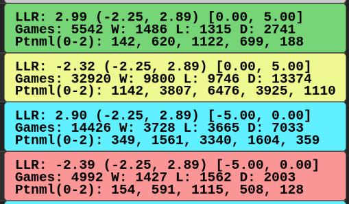

# Sequential Probability Ratio Test

The state-of-the-art method of testing an engine's strength during development is through a [Sequential Probability Ratio Test](https://en.wikipedia.org/wiki/Sequential_probability_ratio_test), or SPRT.
SPRT is a statistical method of sequential hypothesis testing, so a basic understanding of statistics (hypothesis testing, confidence intervals, etc.) is recommended.

In short, "running SPRT" involves having the old version of the engine play against the new version until you can confidently conclude (within margin of error) whether the performance has changed (as defined by the null/alternative hypotheses).

This guide will go over the basics of how to run SPRT and interpret the results.
I am not a statistician, so I will gloss over the theory behind the math.
There are various links within this section (and more [at the end](conclusion.md#references)) that you can click on for further reading, if you are interested in learning more.

## The Basics

SPRT requires that you specify two hypotheses about the Elo differences between the two engines you are testing:

-   `H0`: The elo difference is `elo0`.
-   `H1`: The elo difference is `elo1`.

SPRT then tries to test which one of the hypotheses is _more likely_[^sprt-1].
This is a statistical method, so you must specify a confidence threshold for your comfort level for getting a false positive/negative.

The numerical parameters you must provide are:

-   `elo0` - Elo difference for the null hypothesis (`H0`)
-   `elo1` - Elo difference for the alternative hypothesis (`H1`)
-   `alpha` - Confidence threshold for false positives
-   `beta` - Confidence threshold for false negatives

### Gainer Bounds

If `elo0 + elo1 >= 0`, then you are testing with "gainer" bounds.
You will use gainer bounds when testing a change that you expect to improve the strength of your engine (such as adding a new search feature).

Common values for gainer bounds are:

-   `[0.0, 10.0]` for weaker engines (<2500 Elo), or for implementing features that are expected to gain large amounts of Elo (such as [MVV-LVA](https://www.chessprogramming.org/MVV-LVA))
-   `[0.0, 5.0]` for stronger engines or for features that may not gain significantly.

In general, gainer bounds have `elo0 := 0`, and `elo1` is smaller if the expected gain is also smaller.

### Non-Regression Bounds

If `elo0 + elo1 < 0`, then you are testing with "non-regression" bounds.
You will use non-regression bounds when testing a change to ensure that it does not cause the engine to lose (too much) Elo (such as _refactoring_, or "non-functional" changes).

Common values for non-regression bounds are:

-   `[-10.0, 0.0]` for weaker engines (<2500 Elo).
-   `[-5.0, 0.0]` for stronger engines.

In general, non-regression bounds have `elo1 := 0`.

[^sprt-1]: **Note:** SPRT does _not_ tell you the _exact_ Elo difference between two engines. It merely provides a _likelihood_ that the Elo difference is closer to `elo0` or closer to `elo1`.

## Interpreting Results

At a basic level, the only numerical value you should be concerned with is the one labelled `LLR`.
`LLR` stands for Log Likelihood Ratio, and, in short, states which of hypotheses to accept.
This number will update regularly as the SPRT continues and more data is collected, and will eventually reach either the negative or positive bound.
With a standard 95% confidence threshold, the LLR bounds will be `(-2.94, 2.94)`.

A _positive_ LLR means that our _alternative_ hypothesis (`H1`) is _more likely_ to be true than our _null_ hypothesis (`H0`).
A _negative_ LLR means that our _null_ hypothesis (`H0`) is _more likely_ to be true than our _alternative_ hypothesis (`H1`).
In general, you will most often want tests to conclude with a _positive_ LLR.

OpenBench will color the test results according to the test type and the results:

<p align="center">
  
</p>

|         Color         | Meaning                           |
| :-------------------: | --------------------------------- |
|         Green         | Passed with gainer bounds         |
|         Blue          | Passed with non-regression bounds |
|          Red          | Failed                            |
| Yellow [^fail-yellow] | Failed, but `W >= L`              |

[^fail-yellow]: If a test "fails yellow" then you should use caution when determining whether to integrate those changes. If `W/L` is significantly large, then you may want to re-run the test with tighter bounds.

### Examples

Here we have an example OpenBench output for a completed SPRT:

```
Elo   | 13.87 +- 7.58 (95%)
SPRT  | 8.0+0.08s Threads=1 Hash=16MB
LLR   | 2.90 (-2.25, 2.89) [0.00, 5.00]
Games | N: 4186 W: 1197 L: 1030 D: 1959
Penta | [130, 455, 782, 570, 156]
```

In short: This gainer test passed, concluding that the changes being tested are an improvement for the engine.

#### Explanation

```
Elo   | 13.87 +- 7.58 (95%)
```

The estimated Elo difference between the two engines being tested is between `[6.29, 21.45]`, and the test was ran with a `95%` confidence threshold.

These values should _not_ be trusted for accuracy, as they are only estimates, and Elo ratings are [dependant on the sample space](https://en.wikipedia.org/wiki/Elo_rating_system#Ratings_of_computers).
In the `X +- Y` format, `X` is the estimated Elo difference and `Y` is the error margin.
In general, if `X > Y`, you can assume (within the confidence threshold) that the result is sound and that there is a measurable Elo difference between the engines.
If `X <= Y`, you must collect more samples ("small sample size" or "sss") by letting the test continue to run.

```
SPRT  | 8.0+0.08s Threads=1 Hash=16MB
```

This test was ran at a time control of `8.0` seconds per side with a `0.08` second increment per move.
Each engine was told to search in single-threaded mode with a `16mb` [hash table](https://backscattering.de/chess/uci/#engine-option-hash).

```
LLR   | 2.90 (-2.25, 2.89) [0.00, 5.00]
```

The bounds of this test were `elo0 := 0.00`, `elo1 := 5.00`, meaning this was a "gainer" test, and the changes being tested were expected to improve the strength of the engine.
`LLR := 2.90`, meaning that `H1` was accepted.

```
Games | N: 4186 W: 1197 L: 1030 D: 1959
```

`4186` games were played, with the "new" engine winning `1197`, losing `1030`, and drawing `1959`.

```
Penta | [130, 455, 782, 570, 156]
```

Games are ran in pairs, so each engine plays once as White and once as Black.
So, within a "game pair" you can either gain `0`, `1/2`, `1`, `3/2`, or `2` points.
In this case, the NEW engine:

-   Scored `0` points (lost as both sides on a game pair) `130` times
-   Scored `1/2` points (lost and drew on a game pair) `455` times
-   Scored `1` point (either won and lost or drew twice on a game pair) `782` times
-   Scored `3/2` points (won and drew on a game pair) `570` times
-   Scored `2` points (won as both sides on a game pair) `156` times

## Software for Running SPRTs

As stated in the introduction, this guide will focus on using [OpenBench](https://github.com/AndyGrant/OpenBench) as our testing framework, as it offers significant advantages (such as distributed testing) over a basic command-line tool.
We will look at how to set up and use OpenBench in a [later section](openbench.md), as it is much more lengthy than downloading and running an executable.

However, if you want an alternative approach (that does not require as much setup), you may consider [`fastchess`](https://github.com/Disservin/fastchess) or [`cutechess`](https://github.com/cutechess/cutechess).
These are command-line tools that you can use to run SPRTs locally.
The exact command you need to run will vary depending on the software you are using, as well as other factors like test bounds, opening books, etc.
See the relevant documentation for the software you choose to use.

[Here](https://www.chessprogramming.org/Sequential_Probability_Ratio_Test#Performing_an_SPRT_Test_With_Gainer_Bounds) is an example of running an SPRT with `fastchess`:

```bash
fast-chess -engine cmd=[Path to NEW ENGINE] name=engine_NEW -engine cmd=[Path to OLD ENGINE] name=engine_OLD -each tc=8+0.08 -rounds 15000 -repeat -concurrency [Number of Available Threads] -recover -randomseed -openings file=[Path to Opening Book] format=[Opening book format (pgn or epd)] -sprt elo0=0 elo1=5 alpha=0.05 beta=0.05
```

And here is an example of running an SPRT with `cutechess-cli`:

```bash
cutechess-cli -repeat -recover -variant standard -concurrency 10 -games 640 -resign movecount=3 score=400 -engine dir=Engines/ cmd=./engine_NEW proto=uci tc=8.71+0.09 timemargin=250 option.Threads=1 option.Hash=16 name=Engine-NEW -engine dir=Engines/ cmd=./engine_OLD proto=uci tc=8.71+0.09 timemargin=250 option.Threads=1 option.Hash=16 name=Engine-OLD -openings file=Books/UHO_Lichess_4852_v1.epd format=epd order=random start=19777 -srand 944
```
